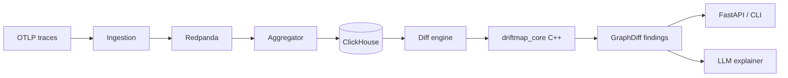

# Driftmap

Driftmap detects meaningful behavioral changes between two deployments of a distributed service by comparing probabilistic call graphs built from OpenTelemetry traces. It combines a high-performance C++ core for statistics, graph diffing, and trace reconstruction with Python services for ingestion, storage, APIs, and LLM-assisted explanations.

The goal is to answer questions like: *Did this rollout change latency on the critical path? Did a new dependency appear? Did error rates shift in a statistically significant way?*

---

## How it works



1. **Ingest** — OTLP spans arrive via an ingester (Python first; optional C++ `driftmap-ingestd` later).
2. **Aggregate** — Span pairs are rolled into hourly edge statistics (call frequency, latency samples, error rates).
3. **Store** — ClickHouse holds raw spans, edge aggregates, and persisted diff results.
4. **Diff** — The C++ diff engine compares two `ProbabilisticCallGraph` snapshots (topology, latency, errors, critical path).
5. **Explain** — Findings are surfaced through a CLI, REST API, and an LLM explainer formatted for Slack or PagerDuty.

---

## Project status

| Area | Status |
|------|--------|
| C++ stats (`ks_2samp`, `mann_whitney`, `cohen_d`) | **Implemented** |
| pybind11 module `driftmap_core` | **Implemented** |
| CMake + pip build | **Implemented** |
| Reference tests (SciPy / NumPy) | **Implemented** |
| Ring buffers, t-digest | Planned |
| Probabilistic call graph types | Planned |
| Trace buffer (sharded reconstruction) | Planned |
| Diff engine (GED beam search, critical path) | Planned |
| ClickHouse schema + materialized views | Planned |
| Redpanda ingestion / aggregation | Planned |
| FastAPI, CLI, LLM explainer | Planned |
| Docker Compose stack | Planned |

Phase 1 delivers the statistical foundation used later when comparing latency and error distributions per edge.

---

## Repository layout

```
Driftmap/
├── driftmap/
│   └── core/                 # C++ core (stats today; graph/diff/trace later)
│       ├── include/
│       └── src/
├── tests/
│   └── test_stats.py         # Phase 1 correctness tests
├── setup.py                  # CMake-backed setuptools build
├── pyproject.toml
└── README.md
```

Planned additions (not yet present):

```
driftmap/
├── services/
│   ├── ingestion/            # OTLP → Redpanda
│   ├── diff-engine/          # ClickHouse queries, aggregation
│   ├── llm-explainer/        # Claude-powered summaries
│   └── api/                  # FastAPI
├── cli/                      # Click CLI (diff, watch, history, init)
└── infra/docker/             # Compose, ClickHouse init SQL, OTel collector
```

---

## Requirements

**Runtime (after build)**

- Python 3.9+

**Build**

- C++17 compiler (MSVC, GCC, or Clang)
- CMake 3.18+ (system install or `pip install cmake`)
- pybind11 (installed automatically as a build dependency)

**Tests (optional)**

```bash
pip install -e ".[test]"
```

Installs `pytest`, `numpy`, and `scipy` for reference comparisons.

---

## Build and install

Editable install (recommended for development):

```bash
pip install -e .
```

Verify the extension imports:

```bash
python -c "import driftmap_core; print(driftmap_core.ks_2samp([1, 2, 3], [2, 3, 4]))"
```

Run tests:

```bash
pytest tests/test_stats.py -v
```

---

## Current API (`driftmap_core`)

| Function | Returns | Description |
|----------|---------|-------------|
| `ks_2samp(a, b)` | `float` | Two-sample Kolmogorov–Smirnov p-value |
| `mann_whitney(a, b)` | `float` | Mann–Whitney U two-sided p-value (normal approximation with tie correction) |
| `cohen_d(a, b)` | `float` | Cohen's d effect size (pooled standard deviation) |

All functions accept any iterable of floats. Empty samples raise `ValueError`.

```python
import driftmap_core

p = driftmap_core.ks_2samp([1.0, 2.0, 3.0], [2.0, 3.0, 4.0, 5.0])
d = driftmap_core.cohen_d(latencies_v1, latencies_v2)
```

---

## Planned C++ core

The full native layer will expose:

- **`RingBuffer` / `TDigest`** — bounded latency samples and streaming quantiles
- **`ProbabilisticCallGraph`** — service-level nodes and edges with call frequency, latency samples, and error rates
- **`TraceBuffer`** — sharded, thread-safe partial trace reconstruction from OTLP spans
- **`run_diff(v1, v2)`** — multi-phase diff:
  1. Topology + graph edit distance (beam search)
  2. Latency regression/improvement (KS, Mann–Whitney, Cohen's d, p99 delta)
  3. Error-rate change (two-proportion z-test)
  4. Critical path comparison
  5. New/removed dependency findings

Key thresholds (planned defaults):

| Constant | Value | Purpose |
|----------|-------|---------|
| `MIN_SAMPLES_FOR_STATS` | 30 | Minimum samples before statistical tests |
| `ALPHA` | 0.05 | Significance level |
| `MIN_EFFECT` | 0.2 | Minimum \|Cohen's d\| |
| `MIN_DELTA_P99_MS` | 5.0 | Minimum p99 latency change (ms) |
| `MIN_ERROR_RATE_DELTA_PP` | 2.0 | Minimum error-rate change (percentage points) |

---

## Planned Python services

### Diff engine (`driftmap/services/diff-engine/`)

- Fetch hourly edge stats from ClickHouse
- Build graph dicts for `run_diff`
- Persist `GraphDiff` results and LLM context payloads

### Ingestion (`driftmap/services/ingestion/`)

- Receive OTLP (HTTP/gRPC)
- Publish normalized spans to Redpanda topic `otel.spans`

### API (`driftmap/services/api/`)

- `GET/POST /diff` — compare versions for a service and time window
- `GET /deploy` — latest deployment metadata from ClickHouse

### CLI (`driftmap/cli/`)

| Command | Purpose |
|---------|---------|
| `driftmap diff` | Run diff, render findings, optional LLM summary |
| `driftmap watch` | Poll for new deployments and auto-diff |
| `driftmap history` | Query past diff results |
| `driftmap init` | Generate OTel collector config and setup instructions |

### LLM explainer (`driftmap/services/llm-explainer/`)

- Format `GraphDiff` context for Claude
- Output capped summaries for Slack / PagerDuty

---

## Planned infrastructure

**ClickHouse tables**

- `spans` — raw OTLP spans (90-day TTL)
- `trace_edges` — parent/child edge events
- `edge_stats_hourly` — materialized view with t-digest quantiles
- `diff_results` — serialized findings and explanations

**Docker Compose stack**

- ClickHouse, Redpanda, OpenTelemetry Collector
- Optional: API, aggregator, ingester services

**Configuration** (`.env.example`, planned)

```
CLICKHOUSE_HOST=
CLICKHOUSE_PORT=
REDPANDA_BROKERS=
ANTHROPIC_API_KEY=
DRIFTMAP_OTLP_TOPIC=otel.spans
```

---

## Development roadmap

| Milestone | Deliverable |
|-----------|-------------|
| M1 | Ring buffer + t-digest |
| M2–M3 | Stats core + pybind11 (**M3 largely complete**) |
| M4 | Graph types (`Span`, `EdgeKey`, `ProbabilisticCallGraph`) |
| M5 | Trace buffer + unit tests |
| M6–M8 | Diff engine (topology, stats phases, critical path) |
| M9 | Full pybind11 surface + `test_diff_engine.py` |
| M10 | ClickHouse init SQL |
| M11 | Aggregator + ingester |
| M12 | Engine (ClickHouse → `run_diff`) |
| M13 | LLM explainer + FastAPI |
| M14 | CLI + Rich renderer |
| M15 | Integration tests with ClickHouse |
| M16 | `watch`, Docker Compose, synthetic demo |

---

## Contributing

The project is under active development. When adding C++ code:

1. Place headers in `driftmap/core/include/` and sources in `driftmap/core/src/`.
2. Register new translation units in `driftmap/core/CMakeLists.txt`.
3. Expose Python bindings in `driftmap/core/src/bindings.cpp`.
4. Add pytest coverage under `tests/` (use SciPy/NumPy only in tests, not production).

---

## License

License not yet specified. Check with the repository maintainers before redistribution.
